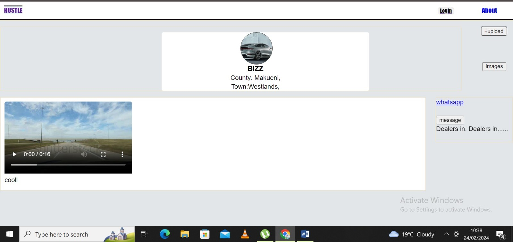
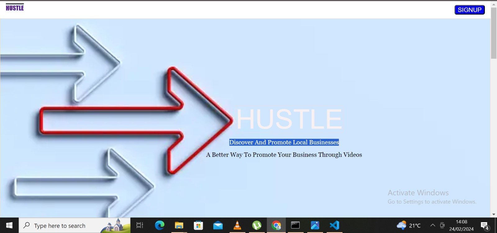
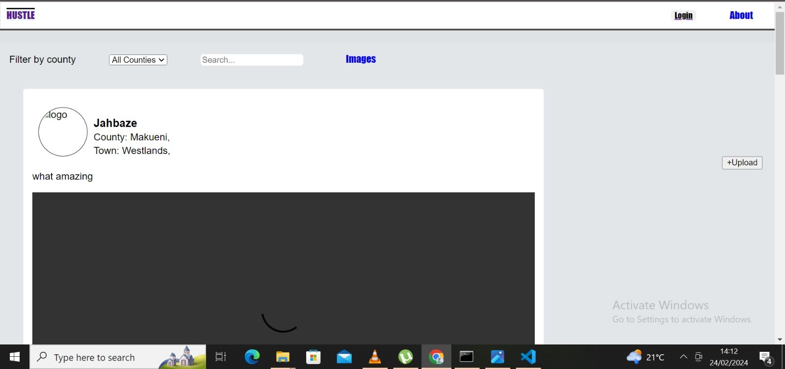

Hustle ~ Discover And Promote Local Businesses

__Introduction__

__The Project__
Every business understands the importance of marketing its products, while everyone knows the frustration of searching for what they want on the internet, not to mention physically walking around. That's precisely why I created Hustle.

Hustle aims to provide businesses with a platform to showcase their products through short videos and images. Users can easily search for what they need within their preferred locations, and businesses have the option to include their precise locations. Business owners can manage more than one business and post unlimited content.

**The Context**
This project serves as my Portfolio Project, marking the culmination of my software engineering program at ALX. I chose this project out of passion and as a means to showcase my ability to bring an idea to life and apply what I have learned.

**The Developer**
**.**Hiram Kabuagi - Enterprise manager, Enterprenuer and a software engineer
linkedin: https://www.linkedin.com/in/hiram-kabuagi-626676243/

**Tutorial**

**Take a tour of the deployed Hustle App**

__Hustle landing page.__

__Hustle home page.__

__Hustle user page/business page.__

